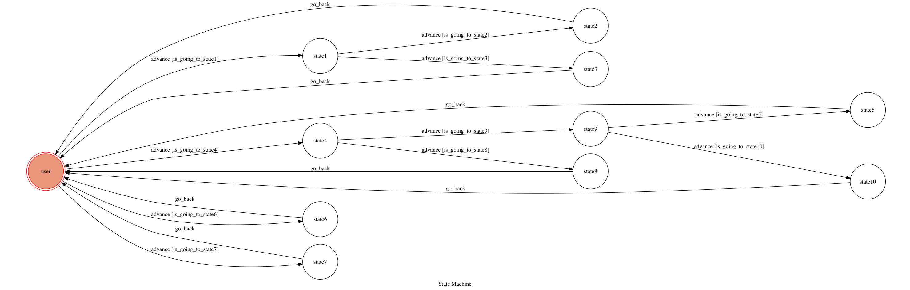

# TOC Project 2019

A Facebook messenger bot based on a finite state machine

## Finite State Machine

## Usage

* messenger
	* Input: "你好"
		* Reply: "請問您有什麼問題：\n(1)沒事\n(2)不想上課\n請回覆1或2"
		    * Input: 1 or 2

	* Input: "介紹"
		* Reply: "哈囉～我叫宋金操，目前是一名大學生\n你可以透過輸入以下數字來更瞭解我喔!:\n(1) 聯絡資料。\n(2) 想了解別人\n"
		    * Input: 1 or 2
    * Input: "即時新聞"
         * Reply: 當天即時新聞
    * Input: "減肥"
         * Reply: "希望你能繼續保持下去～加油！"

## Reference
 Google大神
